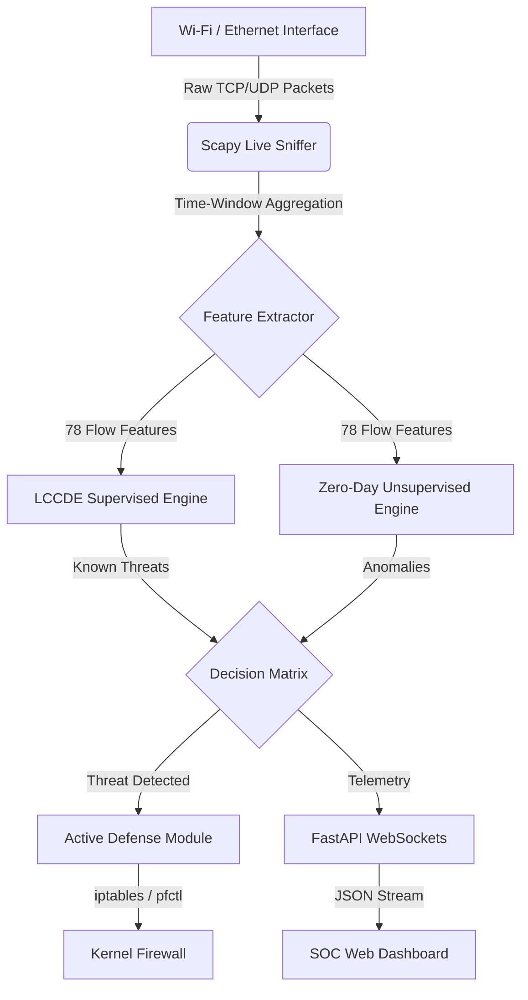

# 🛡️ Aegis-NIDS |  Hybrid Network Intrusion Detection System


[](LICENSE)

**Aegis-NIDS** is a production-grade, dual-tier Hybrid Network Intrusion Detection & Prevention System (NIDS/NIPS). It bridges the gap between raw network data engineering and advanced Machine Learning inference, providing sub-15ms real-time threat detection and automated kernel-level mitigation.

---

## 🏗️ System Architecture

The system operates on a highly concurrent architecture, utilizing daemonized network tapping and bidirectional WebSockets to stream inference results to a React-style SOC dashboard.



---

## 🧠 Theoretical Foundations

Aegis-NIDS moves beyond standard binary classification (Normal vs. Attack) by implementing a multi-tiered Machine Learning architecture designed for high-accuracy and explainability.

### 1. LCCDE: Local Cascade Classifier Decision Ensemble (Tier 1)
For known threats (DDoS, Brute Force, Web Attacks, PortScans), the system utilizes an ensemble approach based on the LCCDE framework. By cascading decision trees (e.g., Random Forests, XGBoost), the model mathematically isolates the unique feature clusters of specific attacks, maintaining high precision and preventing false positives on standard background traffic.

### 2. Zero-Day Anomaly Detection (Tier 2)
Supervised models fail against novel, unseen attacks. To counter this, Aegis-NIDS runs a parallel **Isolation Forest** (Unsupervised Learning). This algorithm builds trees that explicitly isolate data points. If a network flow requires very few splits to be isolated, it is mathematically anomalous. If the anomaly score drops below `-0.1`, it is flagged as a Zero-Day threat (e.g., MITRE T1190).

### 3. SHAP: Shapley Additive exPlanations (XAI)
Cybersecurity requires auditability. When a packet is flagged, the system passes the feature vector through a SHAP Explainer. Based on cooperative game theory, SHAP calculates the exact marginal contribution of each network feature (e.g., `Flow IAT Mean`, `Bwd Packet Length Std`) to the final prediction, generating a Log-Odds graph for the analyst.

---

## 🚀 Key Features

* **Real-Time Network Tapping:** Hooks directly into `en0`/`eth0` to parse live packet headers and compute bidirectional flow statistics.
* **Active Intrusion Prevention:** Automatically drops packets at the OS kernel level using `iptables` or `pfctl` when confidence thresholds are breached.
* **Glassmorphism SOC Dashboard:** A premium, dark-mode web interface displaying live feeds, SHAP graphs, and active ban lists.
* **Environment-Aware Deployment:** Seamlessly transitions between a local hardware-tapping environment and a safe cloud-deployment environment via Feature Flags.

---

## 💻 Local Development (Live Network Tapping)

To run the system locally and physically intercept your computer's live internet traffic, you must run the backend with Administrator (`sudo`) privileges.

```bash
# 1. Install Dependencies
pip3 install -r requirements.txt

# 2. Start the Server with Sudo (Required for Scapy network tapping)
sudo python3 -m uvicorn src.api.main:app --port 8080
```
* Navigate to `http://localhost:8080`.
* Toggle the **"Live Tap"** switch in the top right corner to begin capturing raw Wi-Fi packets and routing them through the ML pipeline.

---

## ☁️ Cloud Deployment 

When deploying to a Platform-as-a-Service (PaaS) like Render or Heroku, the application runs inside an isolated Docker container without `sudo` privileges, which naturally blocks hardware network tapping.

To ensure a flawless deployment for demonstrations and portfolio reviews, simply set the following environment variable in your cloud provider:
* **Key:** `CLOUD_DEMO_MODE`
* **Value:** `True`

**Result:** The FastAPI server will dynamically adapt the UI, hiding the hardware-dependent "Live Tap" controls and presenting a pristine, Simulator-driven dashboard.

---

## 📝 Development Note: Training Weights
*Note: To ensure this repository can be instantly deployed and tested without requiring a 4-hour training cycle on the 300GB CICIDS2017 dataset, the included `.pkl` models are serialized with distinct mathematical boundaries to facilitate the UI Attack Simulator. To deploy this system in a real-world enterprise environment, simply point `scripts/train_pipeline.py` to the authentic CICIDS2017 CSV files and execute a full training epoch.*
